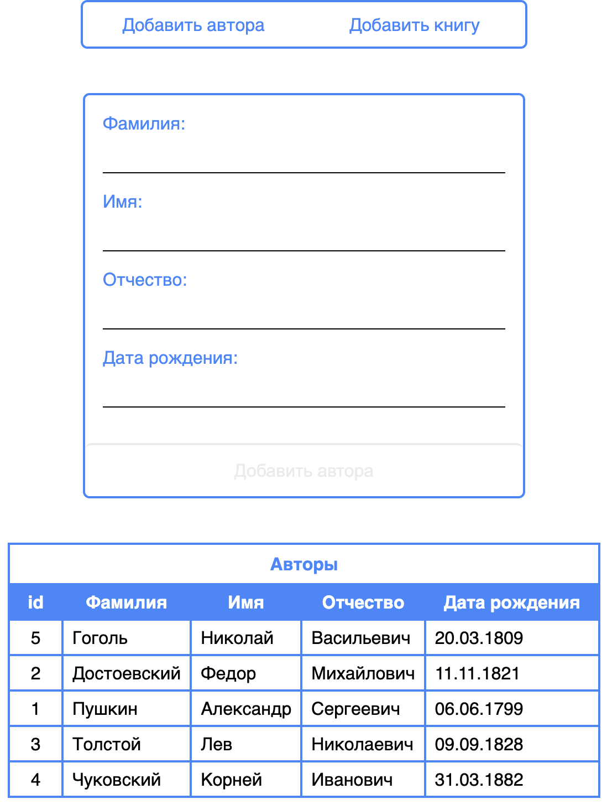
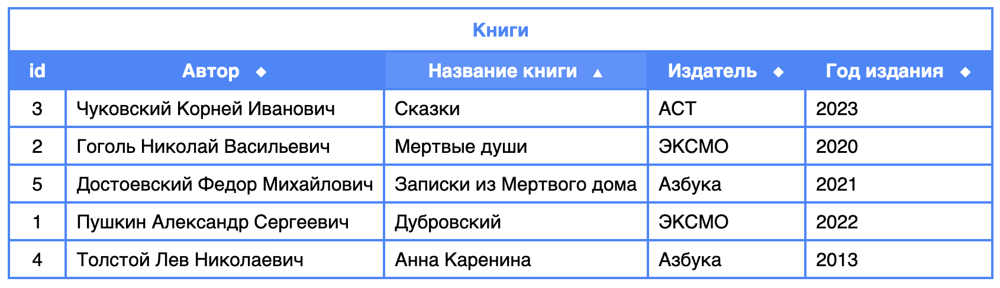

# Library

This is my first test task with Angular.
The idea of SPA is to create service for adding authors and books to the tables.

## Authors page

There are 2 routes in the application. Main route, /authors, with redirect from non-existent routes.

The authors in the table immediately sorting by last name.

## Books page

The second route is /books.

You can choose author from the select field.

The table with books is not sorted by default, but you can change row order by clicking on the headers.

Ascending by full name.

Descending by book title

## Some features

- There are OnPush change detection strategy in the application.
- The /books route with lazy loading.
- The data is saved to the local storage.
- The application navbar always at the top of screen.
- The tables have sticky headers.
